# NVIDIA Hopper 架构深度解析

> 原文来源：[NVIDIA Developer Blog](https://developer.nvidia.com/blog/nvidia-hopper-architecture-in-depth/)
> 作者：Michael Andersch, Greg Palmer, Ronny Krashinsky, Nick Stam, Vishal Mehta, Gonzalo Brito, Sridhar Ramaswamy
> 发布日期：2022年3月22日

---

## 引言

在2022年NVIDIA GTC主题演讲中，NVIDIA首席执行官黄仁勋（Jensen Huang）推出了基于全新NVIDIA Hopper GPU架构的NVIDIA H100 Tensor Core GPU。本文将深入介绍H100 GPU的内部结构，并详细描述NVIDIA Hopper架构GPU的重要新特性。

---

## 一、NVIDIA H100 Tensor Core GPU 简介

NVIDIA H100 Tensor Core GPU是第九代数据中心GPU，旨在为大规模AI和高性能计算（HPC）提供比上一代NVIDIA A100 Tensor Core GPU数量级的性能飞跃。H100继承了A100的主要设计重点，即改善AI和HPC工作负载的强扩展性（strong scaling），并在架构效率方面实现了显著提升。

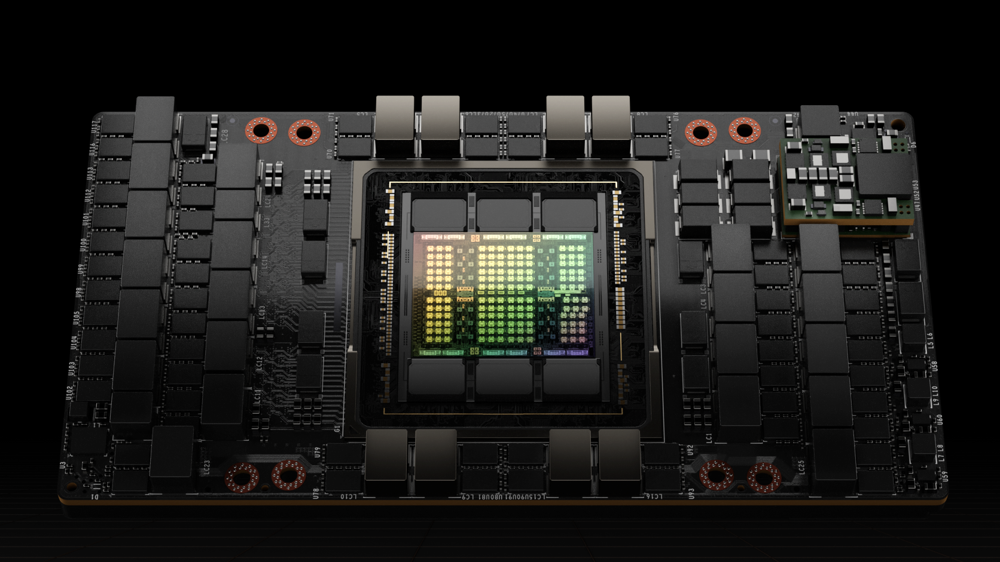

*图1. NVIDIA H100 GPU 搭载全新 SXM5 模块*

对于当今主流的AI和HPC模型，采用InfiniBand互连的H100可提供高达A100 30倍的性能。全新的NVLink Switch System互连技术针对一些最大、最具挑战性的计算工作负载，这些工作负载需要在多个GPU加速节点之间进行模型并行才能容纳。这些工作负载获得了又一次代际性能飞跃，在某些情况下，相比采用InfiniBand的H100，性能再次提升了三倍。

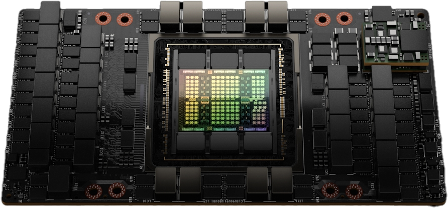

*图2. H100 实现下一代 AI 与 HPC 突破*

> **注**：所有性能数据均为初步数据，基于当前预期，最终产品可能会有所变化。A100集群：HDR IB网络。H100集群：NDR IB网络，在标注处使用NVLink Switch System。GPU数量：气候建模1K、LQCD 1K、基因组学8、3D-FFT 256、MT-NLG 32（批次大小：A100为4，H100在1秒时为60，在1.5秒和2秒时A100为8，H100为64）、MRCNN 8（批次32）、GPT-3 16B 512（批次256）、DLRM 128（批次64K）、GPT-3 16K（批次512）、MoE 8K（批次512，每个GPU一个专家）。NVLink Switch System技术目前尚未在H100系统中提供，但相关系统和可用性将会公布。

在GTC 2022春季大会上，NVIDIA发布了全新的NVIDIA Grace Hopper超级芯片产品。NVIDIA Hopper H100 Tensor Core GPU将为NVIDIA Grace Hopper超级芯片CPU+GPU架构提供动力，该架构专为TB级加速计算而构建，可为大型模型AI和HPC提供高达10倍的性能提升。

NVIDIA Grace Hopper超级芯片利用Arm架构的灵活性，从头开始创建专为加速计算设计的CPU和服务器架构。H100通过超快速的NVIDIA芯片到芯片互连与NVIDIA Grace CPU配对，提供900 GB/s的总带宽，比PCIe Gen5快7倍。这一创新设计相比当今最快的服务器，可提供高达30倍的总带宽，并为使用TB级数据的应用提供高达10倍的性能提升。

### NVIDIA H100 GPU 关键特性总结

- **全新流式多处理器（SM）**带来了诸多性能和效率改进，关键新特性包括：
  - **第四代Tensor Core**：相比A100，芯片到芯片速度提升高达6倍，包括每个SM的加速、额外的SM数量以及更高的时钟频率。在每个SM的基础上，Tensor Core在等效数据类型上提供A100 SM 2倍的MMA（矩阵乘累加）计算速率，而使用新的FP8数据类型时，速率是A100的4倍（相比上一代16位浮点选项）。稀疏性（Sparsity）功能利用深度学习网络中的细粒度结构化稀疏性，使标准Tensor Core操作的性能翻倍。
  - **全新DPX指令**：将动态规划算法的性能比A100 GPU加速高达7倍。两个典型例子包括用于基因组学处理的Smith-Waterman算法，以及用于在动态仓库环境中为机器人车队寻找最优路径的Floyd-Warshall算法。
  - **IEEE FP64和FP32处理速率提升3倍**：芯片到芯片相比A100，得益于每个SM时钟对时钟性能提升2倍，加上额外的SM数量和更高的时钟频率。
  - **全新线程块集群（Thread Block Cluster）**特性：支持以大于单个SM上单个线程块的粒度对局部性进行程序化控制。这扩展了CUDA编程模型，在编程层次结构中增加了另一级别，现在包括线程、线程块、线程块集群和网格。集群支持跨多个SM并发运行的多个线程块进行同步，并协作获取和交换数据。
  - **分布式共享内存（Distributed Shared Memory）**：支持跨多个SM共享内存块直接进行SM到SM的通信，包括加载、存储和原子操作。
  - **全新异步执行特性**：包括全新的**张量内存加速器（Tensor Memory Accelerator, TMA）**单元，可在全局内存和共享内存之间高效传输大块数据。TMA还支持集群内线程块之间的异步拷贝。此外还有全新的**异步事务屏障（Asynchronous Transaction Barrier）**，用于原子数据移动和同步。
- **全新Transformer引擎**：结合软件和定制的NVIDIA Hopper Tensor Core技术，专为加速Transformer模型训练和推理而设计。Transformer引擎智能管理并动态选择FP8和16位计算，自动处理每层之间FP8和16位的重新转换和缩放，相比上一代A100，大型语言模型的AI训练速度提升高达9倍，AI推理速度提升高达30倍。
- **HBM3内存子系统**：相比上一代带宽提升近2倍。H100 SXM5 GPU是全球首款采用HBM3内存的GPU，提供领先的3 TB/秒内存带宽。
- **50 MB L2缓存架构**：可缓存大部分模型和数据集以供重复访问，减少对HBM3的访问次数。
- **第二代多实例GPU（MIG）技术**：相比A100，每个GPU实例的计算容量提升约3倍，内存带宽提升近2倍。首次在MIG级别TEE中提供机密计算能力。最多支持七个独立的GPU实例，每个实例配备专用的NVDEC和NVJPG单元。每个实例现在包含自己的一组性能监视器，可与NVIDIA开发者工具配合使用。
- **全新机密计算支持**：保护用户数据，防御硬件和软件攻击，更好地在虚拟化和MIG环境中隔离和保护虚拟机（VM）。H100实现了全球首款原生机密计算GPU，并以全PCIe线路速率将可信执行环境（TEE）扩展到CPU。
- **第四代NVIDIA NVLink**：在全归约（all-reduce）操作上提供3倍带宽提升，相比上一代NVLink总体带宽提升50%，多GPU IO总带宽达900 GB/秒，运行速度为PCIe Gen 5的7倍。
- **第三代NVSwitch技术**：包括驻留在节点内部和外部的交换机，用于在服务器、集群和数据中心环境中连接多个GPU。节点内的每个NVSwitch提供64端口第四代NVLink链路，以加速多GPU连接。总交换吞吐量的提升：从上一代的7.2 Tbits/秒提升至13.6 Tbits/秒。第三代NVSwitch技术还为集合操作提供硬件加速，支持组播和NVIDIA SHARP网内归约。
- **全新NVLink Switch System互连技术**和基于第三代NVSwitch技术的全新二级NVLink交换机：引入地址空间隔离和保护，支持在2:1锥形胖树拓扑中通过NVLink连接最多32个节点或256个GPU。这些连接节点能够提供57.6 TB/秒的全对全带宽，并可提供惊人的1 exaFLOP FP8稀疏AI计算能力。
- **PCIe Gen 5**：提供128 GB/秒的总带宽（每个方向64 GB/秒），而Gen 4 PCIe的总带宽为64 GB/秒（每个方向32 GB/秒）。PCIe Gen 5使H100能够与最高性能的x86 CPU以及SmartNIC或数据处理单元（DPU）对接。

还有许多其他新特性旨在改善强扩展性、降低延迟和开销，并总体上简化GPU编程。

---

## 二、NVIDIA H100 GPU 架构深入解析

基于全新NVIDIA Hopper GPU架构的NVIDIA H100 GPU具有多项创新：

- 全新第四代Tensor Core在更广泛的AI和HPC任务中执行比以往更快的矩阵计算。
- 全新Transformer引擎使H100相比上一代A100，大型语言模型的AI训练速度提升高达9倍，AI推理速度提升高达30倍。
- 全新NVLink Network互连技术支持跨多个计算节点的多达256个GPU之间的GPU到GPU通信。
- 安全MIG将GPU划分为隔离的、大小合适的实例，以最大化较小工作负载的服务质量（QoS）。

众多其他全新架构特性使许多应用能够获得高达3倍的性能提升。

NVIDIA H100是首款真正的异步GPU。H100将A100的全局到共享异步传输扩展到所有地址空间，并增加了对张量内存访问模式的支持。它使应用能够构建端到端的异步流水线，将数据移入和移出芯片，完全重叠和隐藏数据移动与计算。

使用全新的张量内存加速器（Tensor Memory Accelerator），现在只需少量CUDA线程即可管理H100的完整内存带宽，而大多数其他CUDA线程可以专注于通用计算，例如为新一代Tensor Core预处理和后处理数据。

H100通过名为线程块集群（thread block cluster）的新级别扩展了CUDA线程组层次结构。集群是一组保证被并发调度的线程块，支持跨多个SM的线程进行高效协作和数据共享。集群还能更高效地协作驱动异步单元，如张量内存加速器和Tensor Core。

编排日益增多的片上加速器和多样化的通用线程组需要同步。例如，消耗输出的线程和加速器必须等待生成它们的线程和加速器。

NVIDIA异步事务屏障使集群内的通用CUDA线程和片上加速器能够高效同步，即使它们位于不同的SM上。所有这些新特性使用户和应用能够始终充分利用其H100 GPU的所有单元，使H100成为迄今为止最强大、最可编程且能效最高的NVIDIA GPU。

完整的GH100 GPU采用为NVIDIA定制的台积电4N工艺制造，拥有800亿晶体管，裸片尺寸为814 mm²，采用更高频率设计。

NVIDIA GH100 GPU由多个GPU处理集群（GPC）、纹理处理集群（TPC）、流式多处理器（SM）、L2缓存和HBM3内存控制器组成。

完整版GH100 GPU包含以下单元：

- 8个GPC、72个TPC（每个GPC 9个TPC）、每个TPC 2个SM，完整GPU共144个SM
- 每个SM 128个FP32 CUDA核心，完整GPU共18432个FP32 CUDA核心
- 每个SM 4个第四代Tensor Core，完整GPU共576个
- 6个HBM3或HBM2e堆栈、12个512位内存控制器
- 60 MB L2缓存
- 第四代NVLink和PCIe Gen 5

采用SXM5板型的NVIDIA H100 GPU包含以下单元：

- 8个GPC、66个TPC、每个TPC 2个SM，每个GPU共132个SM
- 每个SM 128个FP32 CUDA核心，每个GPU共16896个FP32 CUDA核心
- 每个SM 4个第四代Tensor Core，每个GPU共528个
- 80 GB HBM3、5个HBM3堆栈、10个512位内存控制器
- 50 MB L2缓存
- 第四代NVLink和PCIe Gen 5

采用PCIe Gen 5板型的NVIDIA H100 GPU包含以下单元：

- 7或8个GPC、57个TPC、每个TPC 2个SM，每个GPU共114个SM
- 每个SM 128个FP32 CUDA核心，每个GPU共14592个FP32 CUDA核心
- 每个SM 4个第四代Tensor Core，每个GPU共456个
- 80 GB HBM2e、5个HBM2e堆栈、10个512位内存控制器
- 50 MB L2缓存
- 第四代NVLink和PCIe Gen 5

采用台积电4N制造工艺使H100能够提高GPU核心频率、提升每瓦性能，并比上一代基于台积电7nm N7工艺的GA100 GPU集成更多的GPC、TPC和SM。

图3展示了具有144个SM的完整GH100 GPU。H100 SXM5 GPU有132个SM，PCIe版本有114个SM。H100 GPU主要用于执行数据中心和边缘计算工作负载，包括AI、HPC和数据分析，但不用于图形处理。SXM5和PCIe H100 GPU中均只有两个TPC具备图形处理能力（即可以运行顶点、几何和像素着色器）。

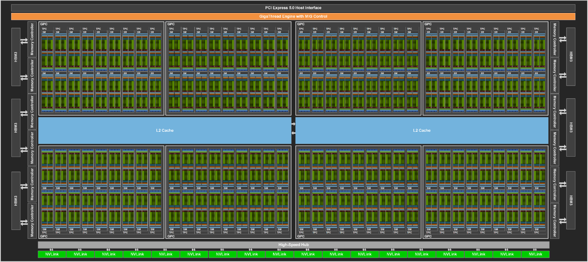

*图3. 包含144个SM的完整GH100 GPU*

---

## 三、H100 SM 架构

基于NVIDIA A100 Tensor Core GPU SM架构构建，H100 SM由于引入了FP8，峰值每SM浮点计算能力是A100的4倍，并且在所有先前的Tensor Core、FP32和FP64数据类型上，原始SM计算能力是A100时钟对时钟的2倍。

全新的Transformer引擎结合NVIDIA Hopper FP8 Tensor Core，相比上一代A100，大型语言模型的AI训练速度提升高达9倍，AI推理速度提升高达30倍。全新的NVIDIA Hopper DPX指令使Smith-Waterman算法（用于基因组学和蛋白质测序）的处理速度比A100提升高达7倍。

全新的NVIDIA Hopper第四代Tensor Core、张量内存加速器以及众多其他SM和通用H100架构改进，共同在许多其他情况下提供高达3倍的HPC和AI性能提升。

| | **NVIDIA H100 SXM5**¹ | **NVIDIA H100 PCIe**¹ |
|---|---|---|
| 峰值 FP64¹ | 30 TFLOPS | 24 TFLOPS |
| 峰值 FP64 Tensor Core¹ | 60 TFLOPS | 48 TFLOPS |
| 峰值 FP32¹ | 60 TFLOPS | 48 TFLOPS |
| 峰值 FP16¹ | 120 TFLOPS | 96 TFLOPS |
| 峰值 BF16¹ | 120 TFLOPS | 96 TFLOPS |
| 峰值 TF32 Tensor Core¹ | 500 TFLOPS \| 1000 TFLOPS² | 400 TFLOPS \| 800 TFLOPS² |
| 峰值 FP16 Tensor Core¹ | 1000 TFLOPS \| 2000 TFLOPS² | 800 TFLOPS \| 1600 TFLOPS² |
| 峰值 BF16 Tensor Core¹ | 1000 TFLOPS \| 2000 TFLOPS² | 800 TFLOPS \| 1600 TFLOPS² |
| 峰值 FP8 Tensor Core¹ | 2000 TFLOPS \| 4000 TFLOPS² | 1600 TFLOPS \| 3200 TFLOPS² |
| 峰值 INT8 Tensor Core¹ | 2000 TOPS \| 4000 TOPS² | 1600 TOPS \| 3200 TOPS² |

*表1. NVIDIA H100 Tensor Core GPU 初步性能规格*

¹ 基于当前预期的H100初步性能估算，最终出货产品可能会有所变化。
² 使用稀疏性（Sparsity）特性后的有效TFLOPS/TOPS。

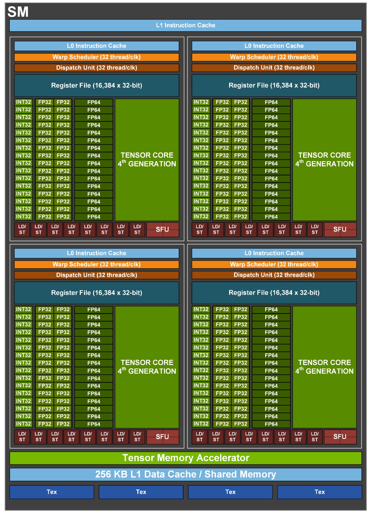

*图4. GH100流式多处理器（SM）*

### H100 SM 关键特性总结

- **第四代Tensor Core**：
  - 相比A100，芯片到芯片速度提升高达6倍，包括每个SM的加速、额外的SM数量以及更高的时钟频率。
  - 在每个SM的基础上，Tensor Core在等效数据类型上提供A100 SM 2倍的MMA（矩阵乘累加）计算速率，而使用新的FP8数据类型时，速率是A100的4倍（相比上一代16位浮点选项）。
  - 稀疏性（Sparsity）功能利用深度学习网络中的细粒度结构化稀疏性，使标准Tensor Core操作的性能翻倍。
- **全新DPX指令**：将动态规划算法的性能比A100 GPU加速高达7倍。两个典型例子包括用于基因组学处理的Smith-Waterman算法，以及用于在动态仓库环境中为机器人车队寻找最优路径的Floyd-Warshall算法。
- **IEEE FP64和FP32处理速率提升3倍**：芯片到芯片相比A100，得益于每个SM时钟对时钟性能提升2倍，加上额外的SM数量和更高的时钟频率。
- 256 KB的共享内存和L1数据缓存组合，比A100大1.33倍。
- **全新异步执行特性**：包括全新的**张量内存加速器（TMA）**单元，可在全局内存和共享内存之间高效传输大块数据。TMA还支持集群内线程块之间的异步拷贝。此外还有全新的**异步事务屏障**，用于原子数据移动和同步。
- **全新线程块集群（Thread Block Cluster）**特性：公开跨多个SM的局部性控制。
- **分布式共享内存（Distributed Shared Memory）**：支持跨多个SM共享内存块直接进行SM到SM的通信，包括加载、存储和原子操作。

### H100 Tensor Core 架构

Tensor Core是专为矩阵乘累加（MMA）数学运算设计的高性能计算核心，为AI和HPC应用提供突破性的性能和效率。一个NVIDIA GPU中跨SM并行运行的Tensor Core与标准浮点（FP）、整数（INT）和乘加（FMA）运算相比，吞吐量和效率大幅提升。

Tensor Core首次在NVIDIA V100 GPU中引入，并在每一代新的NVIDIA GPU架构中进一步增强。

H100中全新的第四代Tensor Core架构在每个SM上提供比A100时钟对时钟高2倍的原始稠密和稀疏矩阵数学吞吐量，考虑到H100相比A100更高的GPU Boost时钟，性能提升更大。支持FP8、FP16、BF16、TF32、FP64和INT8 MMA数据类型。全新的Tensor Core还具有更高效的数据管理，可节省高达30%的操作数传输功耗。

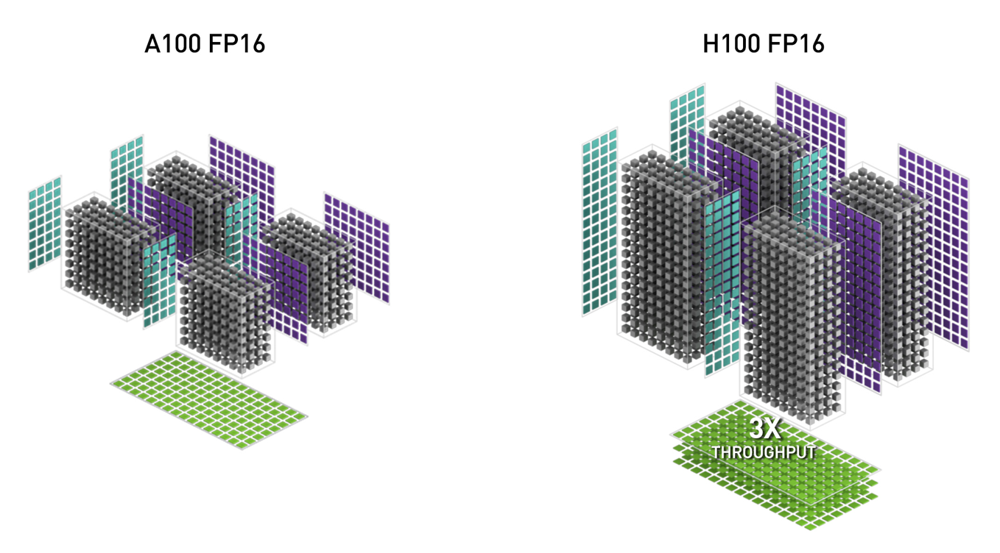

*图5. H100 FP16 Tensor Core 吞吐量相比 A100 FP16 Tensor Core 提升3倍*

### NVIDIA Hopper FP8 数据格式

H100 GPU增加了FP8 Tensor Core，以加速AI训练和推理。如图6所示，FP8 Tensor Core支持FP32和FP16累加器，以及两种新的FP8输入类型：

- **E4M3**：4位指数、3位尾数和1位符号
- **E5M2**：5位指数、2位尾数和1位符号

E4M3支持需要较少动态范围但更高精度的计算，而E5M2提供更宽的动态范围和较低的精度。与FP16或BF16相比，FP8将数据存储需求减半，吞吐量翻倍。

本文后面描述的全新Transformer引擎同时使用FP8和FP16精度来减少内存使用并提高性能，同时仍保持大型语言模型和其他模型的准确性。

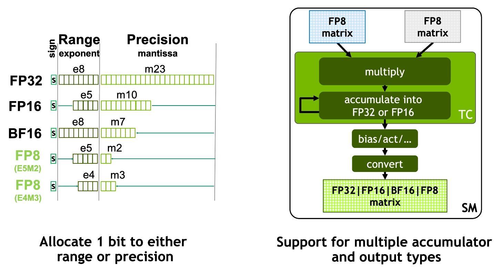

*图6. 全新NVIDIA Hopper FP8精度：吞吐量是H100 FP16或BF16的2倍，占用空间减半*

*图7. H100 FP8 Tensor Core 吞吐量相比 A100 FP16 Tensor Core 提升6倍*

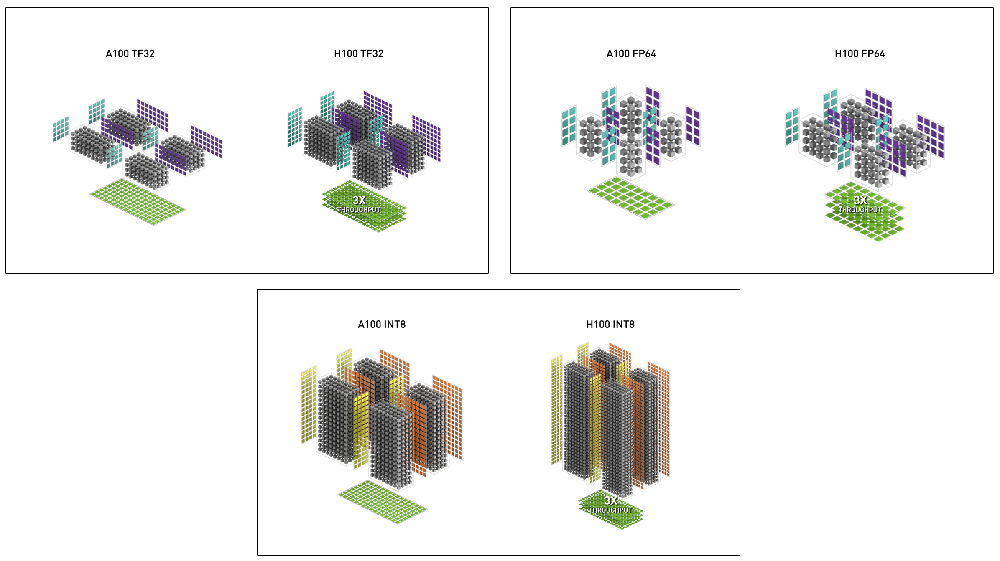

*图8. H100 TF32、FP64和INT8 Tensor Core 吞吐量相比 A100 均提升6倍*

表2展示了H100相比A100在多种数据类型上的数学加速比。

| *(单位为 TFLOPS)* | **A100** | **A100 稀疏** | **H100 SXM5**¹ | **H100 SXM5**¹ 稀疏 | **H100 SXM5**¹ 相比 A100 加速 |
|---|---|---|---|---|---|
| **FP8 Tensor Core** | | | 2000 | 4000 | 相比 A100 FP16 为 6.4x |
| **FP16** | 78 | | 120 | | 1.5x |
| **FP16 Tensor Core** | 312 | 624 | 1000 | 2000 | 3.2x |
| **BF16 Tensor Core** | 312 | 624 | 1000 | 2000 | 3.2x |
| **FP32** | 19.5 | | 60 | | 3.1x |
| **TF32 Tensor Core** | 156 | 312 | 500 | 1000 | 3.2x |
| **FP64** | 9.7 | | 30 | | 3.1x |
| **FP64 Tensor Core** | 19.5 | | 60 | | 3.1x |
| **INT8 Tensor Core** | 624 TOPS | 1248 TOPS | 2000 | 4000 | 3.2x |

*表2. H100 相比 A100 的加速比（H100 初步性能，TC=Tensor Core）*。所有测量单位均为TFLOPS，另有说明除外。

¹ 基于当前预期的H100初步性能估算，最终出货产品可能会有所变化。

### 用于加速动态规划的全新 DPX 指令

许多暴力优化算法具有这样的特性：在解决更大问题时，子问题的解会被重复使用多次。动态规划（DP）是一种算法技术，通过将复杂的递归问题分解为更简单的子问题来求解。通过存储子问题的结果，无需在后续需要时重新计算，DP算法将指数级问题集的计算复杂度降低到线性规模。

DP广泛应用于广泛的优化、数据处理和基因组学算法中：

- 在快速增长的基因组测序领域，Smith-Waterman DP算法是使用最最重要的方法之一。
- 在机器人领域，Floyd-Warshall是关键算法，用于实时在动态仓库环境中为机器人车队寻找最优路径。

H100引入了DPX指令，与NVIDIA Ampere GPU相比，将DP算法的性能加速高达7倍。这些新指令为许多DP算法的内循环提供了高级融合操作数支持。这导致疾病诊断、物流路由优化甚至图分析的求解时间大幅缩短。

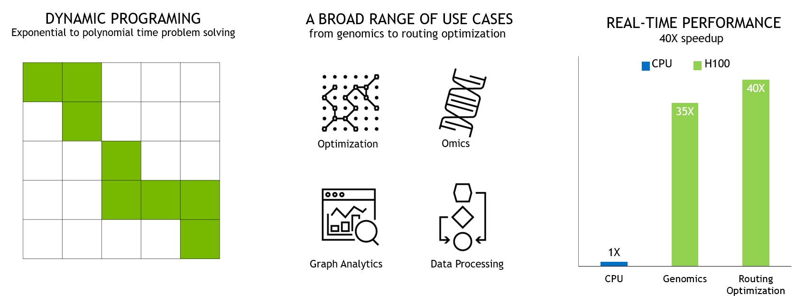

*图9. DPX指令加速动态规划*

### H100 计算性能总结

总体而言，考虑到H100中所有新的计算技术进步，H100相比A100提供了约6倍的计算性能提升。图10以级联方式总结了H100的改进：

- 132个SM相比A100的108个SM，SM数量增加22%。
- 每个H100 SM由于其全新的第四代Tensor Core而快2倍。
- 在每个Tensor Core内部，新的FP8格式和相关的Transformer引擎提供了另一次2倍的改进。
- H100中提高的时钟频率提供了另一次约1.3倍的性能提升。

总之，这些改进使H100的峰值计算吞吐量达到A100的约6倍，这对于世界上计算需求最大的工作负载来说是一个重大飞跃。

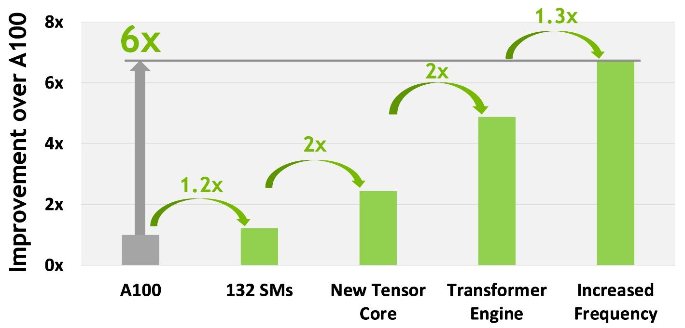

*图10. H100 计算性能提升总结*

H100为全球计算需求最大的工作负载提供6倍吞吐量。

---

## 四、H100 GPU 层次结构与异步改进

实现并行程序高性能的两个关键要素是数据局部性和异步执行。通过将程序数据尽可能靠近执行单元移动，程序员可以利用本地数据的低延迟和高带宽访问所带来的性能。异步执行涉及找到独立的任务，使其与内存传输和其他处理重叠。目标是保持GPU中的所有单元都得到充分利用。

在下一节中，我们将探讨NVIDIA Hopper中添加到GPU编程层次结构中的一个重要新层级，它在比单个SM上的单个线程块更大的规模上公开局部性。我们还将描述提高性能并减少同步开销的全新异步执行特性。

### 线程块集群（Thread Block Clusters）

CUDA编程模型长期以来一直依赖于使用包含多个线程块的网格来利用程序中的局部性的GPU计算架构。一个线程块包含多个在单个SM上并发运行的线程，这些线程可以通过快速屏障同步，并使用SM的共享内存交换数据。然而，随着GPU增长到超过100个SM，计算程序变得更加复杂，线程块作为编程模型中表达局部性的唯一单元，已不足以最大化执行效率。

H100引入了全新的线程块集群架构，在比单个SM上的单个线程块更大的粒度上公开局部性控制。线程块集群扩展了CUDA编程模型，并在GPU的物理编程层次结构中添加了另一个级别，现在包括线程、线程块、线程块集群和网格。

集群是一组保证被并发调度到一组SM上的线程块，目标是实现跨多个SM的线程的高效协作。H100中的集群在GPC内的SM上并发运行。

GPC是硬件层次结构中始终物理上靠近的一组SM。集群具有硬件加速屏障和后续章节讨论的全新内存访问协作能力。GPC内SM之间的专用SM到SM网络为集群中的线程提供快速数据共享。

在CUDA中，如图11所示，网格中的线程块可以在内核启动时选择性地分组为集群，并且集群功能可以通过CUDA cooperative_groups API加以利用。

*图11. 线程块集群与包含集群的网格*

在传统的CUDA编程模型中（如A100所示），网格由线程块组成，如图中左半部分所示。NVIDIA Hopper架构添加了可选的集群层次结构，如图中右半部分所示。

### 分布式共享内存（Distributed Shared Memory）

通过集群，所有线程都可以直接使用加载、存储和原子操作访问其他SM的共享内存。这一特性称为分布式共享内存（DSMEM），因为共享内存虚拟地址空间在逻辑上分布在整个集群的所有块中。

DSMEM实现了SM之间更高效的数据交换，数据不再需要写入全局内存再从中读取来传递。集群的专用SM到SM网络确保了对远程DSMEM的快速、低延迟访问。与使用全局内存相比，DSMEM将线程块之间的数据交换加速了约7倍。

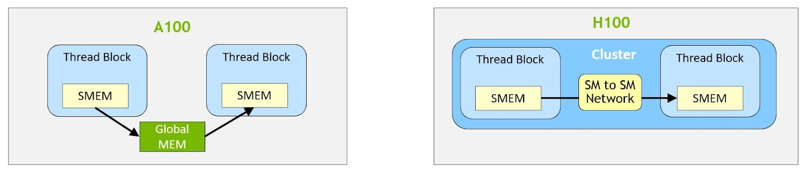

*图12. 线程块到线程块的数据交换（A100 vs. H100 with clusters）*

在CUDA级别，集群中所有线程块的所有DSMEM段都映射到每个线程的通用地址空间中，因此所有DSMEM都可以使用简单的指针直接引用。CUDA用户可以利用cooperative_groups API来构造指向集群中任何线程块的通用指针。DSMEM传输也可以表示为异步拷贝操作，并与基于共享内存的屏障同步以跟踪完成。

图13展示了在不同算法上使用集群的性能优势。集群通过使您能够直接控制比单个SM更大的GPU部分来提高性能。集群支持更大数量线程的协作执行，并可访问比单个线程块更大的共享内存池。

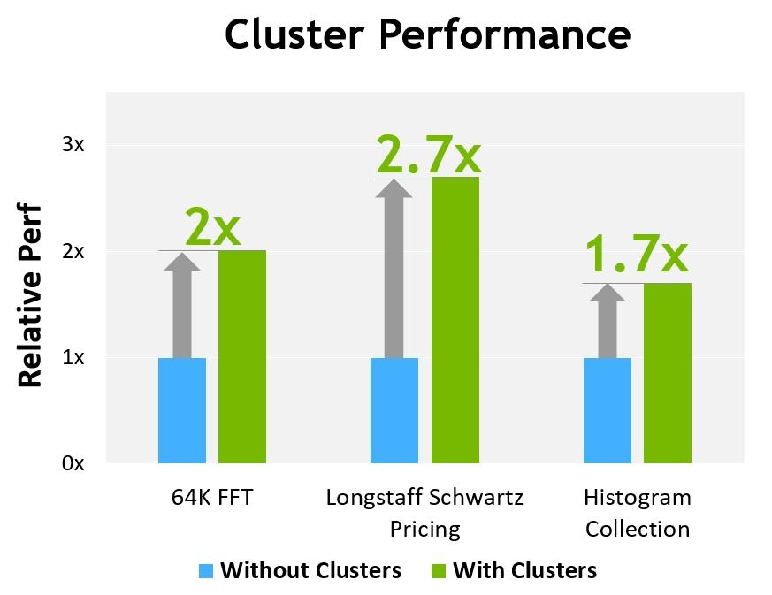

*图13. 集群与非集群性能对比*

> 基于当前预期的H100初步性能估算，最终出货产品可能会有所变化。

### 异步执行

每一代新的NVIDIA GPU都包含众多架构增强功能，以提高性能、可编程性、能效、GPU利用率等诸多因素。最近的NVIDIA GPU几代都包含了异步执行能力，以实现更多数据移动、计算和同步的重叠。

NVIDIA Hopper架构提供了改善异步执行的新特性，并实现更多内存拷贝与计算和其他独立工作的重叠，同时最小化同步点。我们将描述名为张量内存加速器（TMA）的全新异步内存拷贝单元和全新的异步事务屏障。

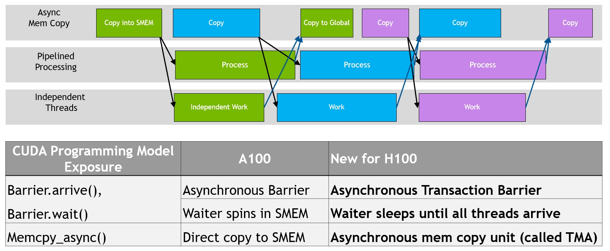

*图14. NVIDIA Hopper 中的异步执行并发与增强*

数据移动、计算和同步的程序化重叠。异步并发和最小化同步点是性能的关键。

#### 张量内存加速器（Tensor Memory Accelerator）

为了帮助供给强大的全新H100 Tensor Core，全新的张量内存加速器（TMA）提高了数据获取效率，它可以在全局内存和共享内存之间传输大块数据和多维张量。

TMA操作使用拷贝描述符启动，该描述符使用张量维度和块坐标而非逐元素寻址来指定数据传输（图15）。可以指定从全局内存加载到共享内存或从共享内存存储回全局内存的大块数据，最大可达共享内存容量。TMA通过支持不同的张量布局（1D到5D张量）、不同的内存访问模式、归约和其他特性，显著降低了寻址开销并提高了效率。

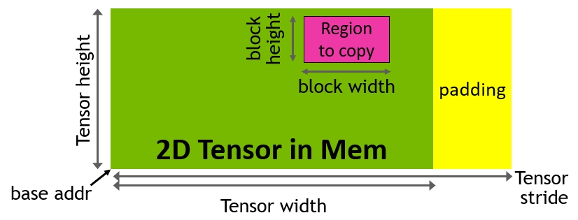

*图15. 通过拷贝描述符进行TMA地址生成*

TMA操作是异步的，并利用A100中引入的基于共享内存的异步屏障。此外，TMA编程模型是单线程的，其中一个warp中的单个线程被选出发出异步TMA操作（`cuda::memcpy_async`）来拷贝张量。因此，多个线程可以等待`cuda::barrier`来完成数据传输。为了进一步提高性能，H100 SM添加了硬件来加速这些异步屏障等待操作。

TMA的一个关键优势是它释放了线程去执行其他独立工作。在A100上（图16，左），异步内存拷贝使用特殊的`LoadGlobalStoreShared`指令执行，因此线程负责生成所有地址并在整个拷贝区域上循环。

在NVIDIA Hopper上，TMA处理一切。单个线程在启动TMA之前创建拷贝描述符，从那时起，地址生成和数据移动由硬件处理。TMA提供了一个更简单的编程模型，因为它接管了拷贝张量段时计算步幅、偏移和边界计算的任务。

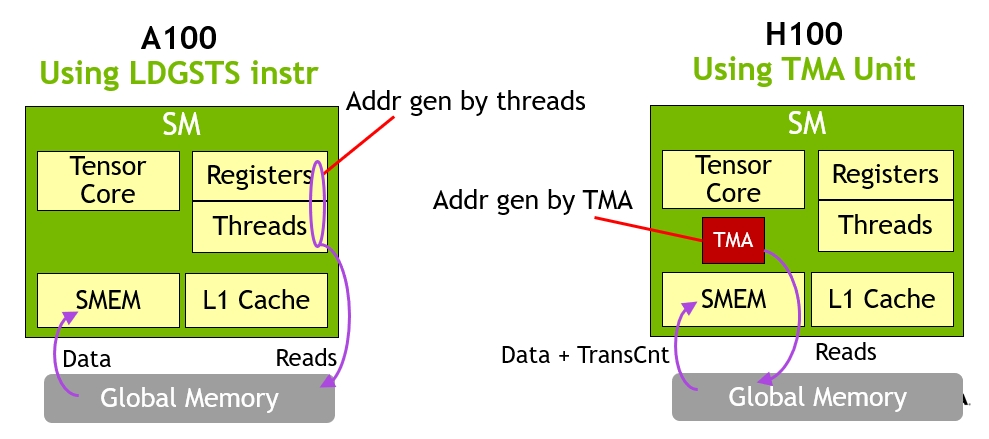

*图16. H100 上 TMA 异步内存拷贝 vs. A100 上 LDGSTS 指令*

#### 异步事务屏障（Asynchronous Transaction Barrier）

异步屏障最初在NVIDIA Ampere架构中引入（图17，左）。考虑一个例子：一组线程产生数据，所有线程在屏障后消费这些数据。异步屏障将同步过程分为两个步骤。

首先，线程在完成产生其共享数据部分时发出`Arrive`信号。这个`Arrive`是非阻塞的，因此线程可以自由执行其他独立工作。

最终，线程需要所有其他线程产生的数据。此时，它们执行`Wait`，这会阻塞它们，直到每个线程都发出了`Arrive`信号。

异步屏障的优势在于，它们使提前到达的线程能够在等待时执行独立工作。这种重叠是额外性能的来源。如果所有线程都有足够的独立工作，屏障实际上就变成了免费的，因为`Wait`指令可以立即退休，因为所有线程都已经到达。

NVIDIA Hopper的新特性是*等待*线程可以休眠，直到所有其他线程到达。在之前的芯片上，等待线程会在共享内存中的屏障对象上自旋。

虽然异步屏障仍然是NVIDIA Hopper编程模型的一部分，但它添加了一种称为异步事务屏障的新屏障形式。异步事务屏障类似于异步屏障（图17，右）。它也是一种分割屏障，但不同的是，它不仅计数线程到达，还计数事务。

NVIDIA Hopper包含一个用于写入共享内存的新命令，该命令传递要写入的数据和事务计数。事务计数本质上是字节计数。异步事务屏障在`Wait`命令处阻塞线程，直到所有生产者线程都执行了`Arrive`，并且所有事务计数的总和达到预期值。

异步事务屏障是异步内存拷贝或数据交换的强大新原语。如前所述，集群可以进行线程块到线程块的通信以进行数据交换并隐含同步，而这种集群能力建立在异步事务屏障之上。

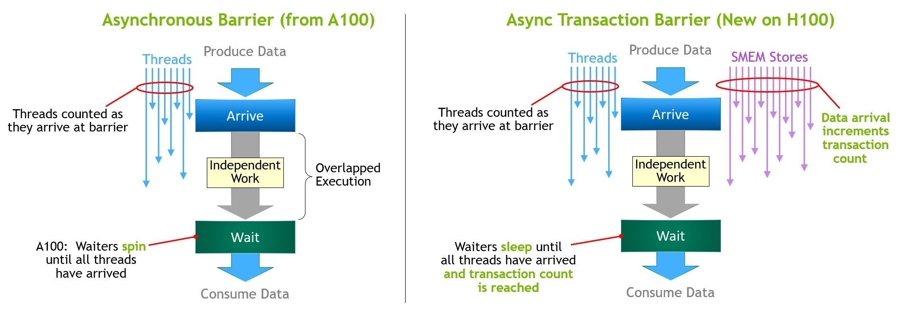

*图17. A100 中的异步屏障 vs. H100 中的异步事务屏障*

---

## 五、H100 HBM 与 L2 缓存内存架构

GPU内存架构和层次结构的设计对应用性能至关重要，并影响GPU尺寸、成本、功耗和可编程性。GPU中存在许多内存子系统，从大量的片外DRAM（帧缓冲器）设备内存、不同级别和类型的片上内存，到SM中计算使用的寄存器文件。

### H100 HBM3 与 HBM2e DRAM 子系统

随着HPC、AI和数据分析数据集持续增长，计算问题日益复杂，更大的GPU内存容量和带宽成为必需。

- NVIDIA P100是全球首款支持高带宽HBM2内存技术的GPU架构。
- NVIDIA V100提供了更快、更高效、容量更大的HBM2实现。
- NVIDIA A100 GPU进一步提高了HBM2性能和容量。

H100 SXM5 GPU将标准大幅提高，支持80 GB（五个堆栈）的快速HBM3内存，提供超过3 TB/秒的内存带宽，实际上比两年前推出的A100的内存带宽增加了2倍。PCIe H100提供80 GB的快速HBM2e，内存带宽超过2 TB/秒。

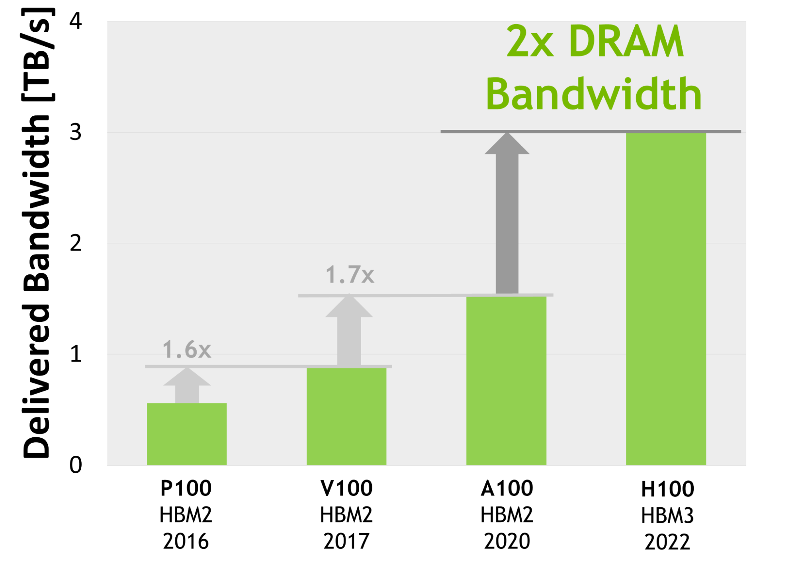

*图18. 全球首款HBM3 GPU内存架构，2倍交付带宽*

> 内存数据速率尚未最终确定，最终产品可能会有所变化。

### H100 L2 缓存

H100中的50 MB L2缓存比A100的40 MB L2大1.25倍。它支持缓存更大部分的模型和数据集以供重复访问，减少对HBM3或HBM2e DRAM的访问，从而提高性能。

使用分区交叉开关结构，L2缓存将数据本地化和缓存，用于来自直接连接到该分区的GPC中SM的内存访问。L2缓存驻留控制优化容量利用率，使您能够选择性地管理应保留在缓存中或应被驱逐的数据。

HBM3或HBM2e DRAM和L2缓存子系统都支持数据压缩和解压缩技术，以优化内存和缓存使用及性能。

### NVIDIA A100 与 H100 数据中心 GPU 对比

| **GPU 特性** | **NVIDIA A100** | **NVIDIA H100 SXM5**¹ | **NVIDIA H100 PCIe**¹ |
|---|---|---|---|
| GPU 架构 | NVIDIA Ampere | NVIDIA Hopper | NVIDIA Hopper |
| GPU 板型 | SXM4 | SXM5 | PCIe Gen 5 |
| SM 数量 | 108 | 132 | 114 |
| TPC 数量 | 54 | 66 | 57 |
| FP32 核心 / SM | 64 | 128 | 128 |
| FP32 核心 / GPU | 6912 | 16896 | 14592 |
| FP64 核心 / SM（不含 Tensor） | 32 | 64 | 64 |
| FP64 核心 / GPU（不含 Tensor） | 3456 | 8448 | 7296 |
| INT32 核心 / SM | 64 | 64 | 64 |
| INT32 核心 / GPU | 6912 | 8448 | 7296 |
| Tensor Core / SM | 4 | 4 | 4 |
| Tensor Core / GPU | 432 | 528 | 456 |
| GPU Boost 时钟 （H100尚未最终确定）³ | 1410 MHz | 尚未最终确定 | 尚未最终确定 |
| 峰值 FP8 Tensor TFLOPS（FP16累加）¹ | 不适用 | 2000/4000² | 1600/3200² |
| 峰值 FP8 Tensor TFLOPS（FP32累加）¹ | 不适用 | 2000/4000² | 1600/3200² |
| 峰值 FP16 Tensor TFLOPS（FP16累加）¹ | 312/624² | 1000/2000² | 800/1600² |
| 峰值 FP16 Tensor TFLOPS（FP32累加）¹ | 312/624² | 1000/2000² | 800/1600² |
| 峰值 BF16 Tensor TFLOPS（FP32累加）¹ | 312/624² | 1000/2000² | 800/1600² |
| 峰值 TF32 Tensor TFLOPS¹ | 156/312² | 500/1000² | 400/800² |
| 峰值 FP64 Tensor TFLOPS¹ | 19.5 | 60 | 48 |
| 峰值 INT8 Tensor TOPS¹ | 624/1248² | 2000/4000² | 1600/3200² |
| 峰值 FP16 TFLOPS（非 Tensor）¹ | 78 | 120 | 96 |
| 峰值 BF16 TFLOPS（非 Tensor）¹ | 39 | 120 | 96 |
| 峰值 FP32 TFLOPS（非 Tensor）¹ | 19.5 | 60 | 48 |
| 峰值 FP64 TFLOPS（非 Tensor）¹ | 9.7 | 30 | 24 |
| 峰值 INT32 TOPS¹ | 19.5 | 30 | 24 |
| 纹理单元 | 432 | 528 | 456 |
| 内存接口 | 5120-bit HBM2 | 5120-bit HBM3 | 5120-bit HBM2e |
| 内存容量 | 40 GB | 80 GB | 80 GB |
| 内存数据速率 （H100尚未最终确定）¹ | 1215 MHz DDR | 尚未最终确定 | 尚未最终确定 |
| 内存带宽¹ | 1555 GB/秒 | 3000 GB/秒 | 2000 GB/秒 |
| L2 缓存容量 | 40 MB | 50 MB | 50 MB |
| 共享内存容量 / SM | 最高可配置 164 KB | 最高可配置 228 KB | 最高可配置 228 KB |
| 寄存器文件容量 / SM | 256 KB | 256 KB | 256 KB |
| 寄存器文件容量 / GPU | 27648 KB | 33792 KB | 29184 KB |
| TDP¹ | 400 瓦 | 700 瓦 | 350 瓦 |
| 晶体管数量 | 542 亿 | 800 亿 | 800 亿 |
| GPU 裸片尺寸 | 826 mm² | 814 mm² | 814 mm² |
| 台积电制造工艺 | 7 nm N7 | 为 NVIDIA 定制的 4N | 为 NVIDIA 定制的 4N |

*表3. NVIDIA A100 与 H100¹ 数据中心 GPU 对比*

¹ 基于当前预期的H100初步规格，最终出货产品可能会有所变化。
² 使用稀疏性（Sparsity）特性后的有效TOPS/TFLOPS。
³ GPU峰值时钟和GPU Boost时钟对于NVIDIA数据中心GPU来说是同义词。

由于H100和A100 Tensor Core GPU设计用于安装在高性能服务器和数据中心机架中，为AI和HPC计算工作负载提供动力，因此它们不包含显示连接器、用于光线追踪加速的NVIDIA RT Core或NVENC编码器。

### 计算能力（Compute Capability）

H100 GPU支持全新的计算能力9.0。表4比较了不同NVIDIA GPU架构的计算能力参数。

| **数据中心 GPU** | NVIDIA V100 | NVIDIA A100 | NVIDIA H100 |
|---|---|---|---|
| GPU 架构 | NVIDIA Volta | NVIDIA Ampere | NVIDIA Hopper |
| 计算能力 | 7.0 | 8.0 | 9.0 |
| 每 warp 线程数 | 32 | 32 | 32 |
| 每 SM 最大 warp 数 | 64 | 64 | 64 |
| 每 SM 最大线程数 | 2048 | 2048 | 2048 |
| 每 SM 最大线程块（CTA）数 | 32 | 32 | 32 |
| 每线程块集群最大线程块数 | 不适用 | 不适用 | 16 |
| 每 SM 最大32位寄存器数 | 65536 | 65536 | 65536 |
| 每线程块（CTA）最大寄存器数 | 65536 | 65536 | 65536 |
| 每线程最大寄存器数 | 255 | 255 | 255 |
| 最大线程块大小（线程数） | 1024 | 1024 | 1024 |
| 每 SM FP32 核心数 | 64 | 64 | 128 |
| SM 寄存器与 FP32 核心比率 | 1024 | 1024 | 512 |
| 每 SM 共享内存容量 | 最高可配置 96 KB | 最高可配置 164 KB | 最高可配置 228 KB |

*表4. 计算能力：V100 vs. A100 vs. H100*

---

## 六、Transformer 引擎

Transformer模型是当今广泛使用的语言模型的支柱，从BERT到GPT-3，它们需要巨大的计算资源。Transformer最初为自然语言处理（NLP）而开发，正越来越多地应用于计算机视觉、药物发现等多样化领域。

它们的规模继续呈指数级增长，现在已达到数万亿参数，导致训练时间延长到数月，这对于业务需求来说是不切实际的，因为计算需求太大。例如，Megatron Turing NLG（MT-NLG）需要2048个NVIDIA A100 GPU运行8周才能训练完成。总体而言，Transformer模型的增长速度比大多数其他AI模型快得多，在过去5年中每2年增长275倍（图19）。

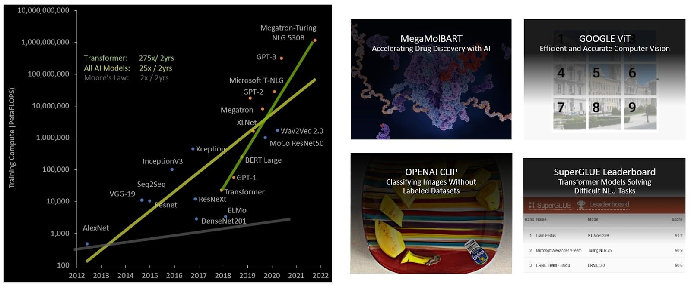

*图19. Transformer模型规模呈指数级增长，应用于众多不同领域*

混合精度的目标是在保持精度的同时智能地管理精度，以获得更小、更快数值格式的性能。在Transformer模型的每一层，Transformer引擎分析Tensor Core产生的输出值的统计信息。

凭借对接下来哪种类型的神经网络层以及它所需的精度的了解，Transformer引擎还决定在存储到内存之前将张量转换为哪种目标格式。与FP8相比，其他数值格式具有更宽的范围。

为了最优地使用可用范围，Transformer引擎还使用从张量统计信息计算的缩放因子，动态地将张量数据缩放到可表示范围内。因此，每一层都使用其所需的精确范围运行，并以最优方式加速。

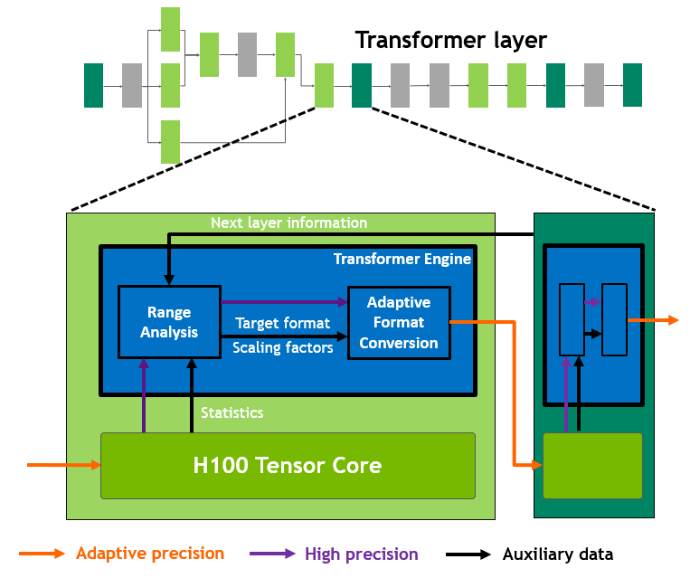

*图20. Transformer引擎概念性操作*

---

## 七、NVLink、NVSwitch 与 NVLink Switch System

第四代NVIDIA NVLink在所有归约（all-reduce）操作上提供3倍带宽提升，相比上一代NVLink总体带宽提升50%，多GPU IO总带宽达900 GB/秒，运行速度为PCIe Gen 5的7倍。

第三代NVSwitch技术包括驻留在节点内部和外部的交换机，用于在服务器、集群和数据中心环境中连接多个GPU。节点内的每个NVSwitch提供64端口第四代NVLink链路，以加速多GPU连接。总交换吞吐量从上一代的7.2 Tbits/秒提升至13.6 Tbits/秒。第三代NVSwitch技术还为集合操作提供硬件加速，支持组播和NVIDIA SHARP网内归约。

全新NVLink Switch System互连技术和基于第三代NVSwitch技术的全新二级NVLink交换机引入地址空间隔离和保护，支持在2:1锥形胖树拓扑中通过NVLink连接最多32个节点或256个GPU。这些连接节点能够提供57.6 TB/秒的全对全带宽，并可提供惊人的1 exaFLOP FP8稀疏AI计算能力。

DGX H100 SuperPod可扩展至多达256个GPU，通过基于第三代NVSwitch技术的全新NVLink Switch在NVLink Switch System上完全连接。

NVLink Network互连在2:1锥形胖树拓扑中实现了惊人的9倍对分带宽提升（例如，对于全对全交换），以及相比上一代InfiniBand系统的4.5倍全归约吞吐量提升。DGX H100 SuperPOD可选择配置NVLink Switch System。

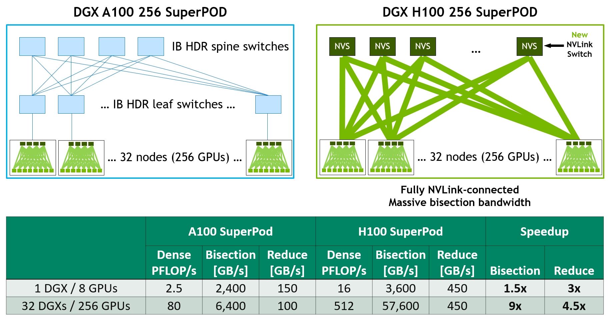

*图21. DGX A100 与 DGX H100 256 节点 NVIDIA SuperPOD 架构对比*

---

## 八、PCIe Gen 5

H100集成了PCI Express Gen 5 x16通道接口，提供128 GB/秒的总带宽（每个方向64 GB/秒），而A100中包含的Gen 4 PCIe总带宽为64 GB/秒（每个方向32 GB/秒）。

通过其PCIe Gen 5接口，H100可以与最高性能的x86 CPU以及SmartNIC和[数据处理单元（DPU）](https://www.nvidia.com/en-us/networking/products/data-processing-unit/)对接。H100专为与NVIDIA BlueField-3 DPU实现最佳连接而设计，用于400 Gb/s以太网或下一代数据速率（NDR）400 Gb/s InfiniBand网络加速，以支持安全的HPC和AI工作负载。

H100增加了对原生子节PCIe原子操作的支持，如原子CAS（比较并交换）、原子交换和32位与64位数据类型的原子取加，从而加速CPU与GPU之间的同步和原子操作。H100还支持单根IO虚拟化（SR-IOV），支持单个PCIe连接GPU的共享和虚拟化，以供多个进程或虚拟机使用。H100允许来自单个SR-IOV PCIe连接GPU的虚拟功能（VF）或物理功能（PF）通过NVLink访问对等GPU。

---

## 九、总结

NVIDIA H100 Tensor Core GPU基于全新的NVIDIA Hopper GPU架构，为大规模AI和HPC工作负载带来了数量级的性能飞跃。通过第四代Tensor Core、全新Transformer引擎、增强的异步执行能力、更高带宽的内存子系统以及更强大的多GPU互连技术，H100成为迄今为止最强大、最可编程且能效最高的NVIDIA数据中心GPU。

有关增强应用性能的H100其他全新和改进特性的更多信息，请参阅 **[NVIDIA H100 Tensor Core GPU 架构白皮书](https://resources.nvidia.com/en-us-tensor-core/gtc22-whitepaper-hopper)**。

---

## 致谢

*我们要感谢Stephen Jones、Manindra Parhy、Atul Kalambur、Harry Petty、Joe DeLaere、Jack Choquette、Mark Hummel、Naveen Cherukuri、Brandon Bell、Jonah Alben以及许多其他NVIDIA GPU架构师和工程师对本文的贡献。*

---

> **免责声明**：本文档为 NVIDIA 官方技术博客的中文翻译版本，仅供学习参考。所有技术规格、性能数据和图片版权归 NVIDIA Corporation 所有。H100 的某些规格为初步数据，最终产品可能会有所变化。
